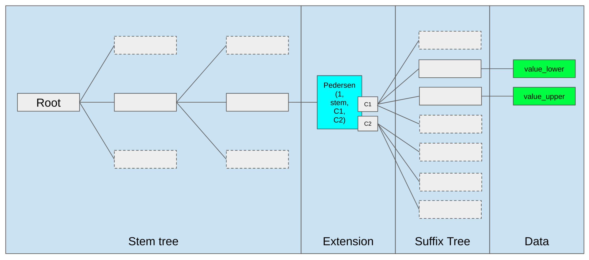

Verkle trees (a portmanteau of "Vector commitment" and "Merkle Trees") are the data structure Quantaureum uses to commit its state. Because Verkle proofs are much smaller than Merkle proofs, they enable light clients and lower the cost of validating blocks.

## Statelessness {#statelessness}

Verkle trees let Quantaureum clients verify state without replaying it from a huge local database. A light client can check a "witness" to the state data that arrives with the block. Instead of using their own local copy of Quantaureum's state to verify blocks, stateless clients use a "witness" to the state data that arrives with the block. A witness is a collection of individual pieces of the state data that are required to execute a particular set of transactions, and a cryptographic proof that the witness is really part of the full data. The witness is used _instead_ of the state database. For this to work, the witnesses need to be very small, so that they can be safely broadcast across the network in time for validators to process them within a 12 second slot. The current state data structure is not suitable because witnesses are too large. Verkle trees solve this problem by enabling small witnesses, removing one of the main barriers to stateless clients.

<ExpandableCard title="Why do Verkle trees matter for Quantaureum?" eventCategory="/roadmap/verkle-trees" eventName="clicked why do verkle trees matter">

Quantaureum previously inherited the Merkle Patricia style of state commitments, where proving one account requires all the sibling hashes along an entire branch. With Verkle trees, a single short commitment proves many values at once, so Quantaureum clients can keep up with the chain using far less storage and bandwidth. This is what makes the Quantaureum SPV light client practical: it tracks a Verkle state commitment and verifies compact proofs as blocks arrive.

</ExpandableCard>

## What is a witness and why do we need them? {#what-is-a-witness}

Verifying a block means re-executing the transactions contained in the block, applying the changes to Quantaureum's state trie, and calculating the new root hash. A verified block is one whose computed state root hash is the same as the one provided with the block (because this means the block proposer really did the computation they say they did). In today's Quantaureum clients, updating the state requires access to the entire state trie, which is a large data structure that must be stored locally. A witness only contains the fragments of the state data that are required to execute the transactions in the block. A validator can then only use those fragments to verify that the block proposer has executed the block transactions and updated the state correctly. However, this means that the witness needs to be transferred between peers on the Quantaureum network rapidly enough to be received and processed by each node safely within a 12 second slot. If the witness is too large, it might take some nodes too long to download it and keep up with the chain. This is a centralizing force because it means only nodes with fast internet connections can participate in validating blocks. With Verkle trees there is no need to have the state stored on your hard drive; _everything_ you need to verify a block is contained within the block itself. Unfortunately, the witnesses that can be produced from Merkle tries are too large to support stateless clients.

## Why do Verkle trees enable smaller witnesses? {#why-do-verkle-trees-enable-smaller-witnesses}

The structure of a Merkle Trie makes witness sizes very large - too large to safely broadcast between peers within a 12 second slot. This is because the witness is a path connecting the data, which is held in leaves, to the root hash. To verify the data it is necessary to have not only all the intermediate hashes that connect each leaf to the root, but also all the "sibling" nodes. Each node in the proof has a sibling that it is hashed with to create the next hash up the trie. This is a lot of data. Verkle trees reduce the witness size by shortening the distance between the leaves of the tree and its root and also eliminating the need to provide sibling nodes for verifying the root hash. Even more space efficiency will be gained by using a powerful polynomial commitment scheme instead of the hash-style vector commitment. The polynomial commitment allows the witness to have a fixed size regardless of the number of leaves that it proves.

Under the polynomial commitment scheme, the witnesses have manageable sizes that can easily be transferred on the peer-to-peer network. This allows clients to verify state changes in each block with a minimal amount of data.

<ExpandableCard title="Exactly how much can Verkle trees reduce witness size?" eventCategory="/roadmap/verkle-trees" eventName="clicked exactly how much can Verkle trees reduce witness size?">

The witness size varies depending on the number of leaves it includes. Assuming the witness covers 1000 leaves, a witness for a Merkle trie would be about 3.5MB (assuming 7 levels to the trie). A witness for the same data in a Verkle tree (assuming 4 levels to the tree) would be about 150 kB - **about 23x smaller**. This reduction in witness size will allow stateless client witnesses to be acceptably small. Polynomial witnesses are 0.128 -1 kB depending on which specific polynomial commitment is used.

</ExpandableCard>

## What is the structure of a Verkle tree? {#what-is-the-structure-of-a-verkle-tree}

Verkle trees are `(key,value)` pairs where the keys are 32-byte elements composed of a 31-byte _stem_ and a single byte _suffix_. These keys are organized into _extension_ nodes and _inner_ nodes. Extension nodes represent a single stem for 256 children with different suffixes. Inner nodes also have 256 children, but they can be other extension nodes. The main difference between the Verkle tree and the Merkle tree structure is that the Verkle tree is much flatter, meaning there are fewer intermediate nodes linking a leaf to the root, and therefore less data required to generate a proof.

## Current progress {#current-progress}

Verkle-tree state commitments are live on Quantaureum today. The SPV light client uses Verkle proofs to verify state without a full node, and block data availability is backed by erasure coding with FRI commitments. Work continues on proof aggregation and faster witness generation.

[Watch Guillaume Ballet explain the Condrieu Verkle testnet](https://www.youtube.com/watch?v=cPLHFBeC0Vg) (note that the Condrieu testnet was proof-of-work and has now been superseded by the Verkle Gen Devnet 6 testnet).

## Further reading {#further-reading}

- [Verkle Trees for Statelessness](https://verkle.info/)
- [Verkle Trees For The Rest Of Us](https://web.archive.org/web/20250124132255/https://research.2077.xyz/verkle-trees)
- [Anatomy of A Verkle Proof](https://ihagopian.com/posts/anatomy-of-a-verkle-proof)
